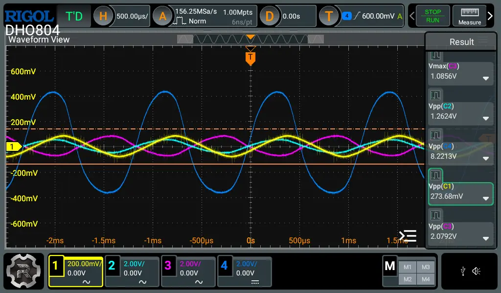

# Bumble Tuby Guitar Amplifier

This is a simple, hybrid guitar amplifier, made as a hobby project.

## Features

- Runs off of a single 12V DC supply.
- Pre-amp based on the 12AX7 vacuum tube.
- Power amplifier based on the LM386 IC.

### Bill of materials

> [!NOTE]  
> This section is yet to be populated.

## To-do

### Circuit design

- [x] Add headphone output.
- [x] Add effects loop:
  - FX send can be driven directly from the 2nd tube stage.
  - FX return needs a buffer before feeding into the power amp section. Can use the second half of the NE5532 for this.
  - What about operation modes? With/without effects loop. This would require a SPDT switch to either send the pre-amped signal into the effects chain, or directly into the buffer.
- [x] Add bypass capacitors on power supply lines:
  - LM386: 10uF, 100nF
  - opamps: 10uF, 100nF
- [x] Add power switch, LED
- [x] Consider poweramp alternatives
  - TPA3110
- [x] Make buffer bias voltage adjustable
- [ ] Fix tube biasing
- [x] Buffer triode outputs (plates)
- [ ] Add a tone control section.
  - Between tube stages?
- [ ] Add screw terminals for vacuum tube connections
- [x] Mute speaker PA when headphone jack plugged in
- [x] Add headphone PA
- [x] Add gain adjustment for the power section (LM386 pins 1-8)
- [x] Split design into separate subschematics
  - How to express connections?
  - [Hierarchical sheets in KiCad](https://docs.kicad.org/9.0/en/eeschema/eeschema.html#drawing-hierarchical-sheets)
- [ ] Add stereo line-in, [signal mixing](https://electronics.stackexchange.com/questions/103435/naively-mixing-two-or-perhaps-more-audio-signals)
- [ ] Design perfboard layout

### CI

- [ ] Render BOM into README, as a Markdown table.

## Credits

This design was inspired by:

- [Ruby Tuby](https://tagboardeffects.blogspot.com/2014/10/ruby-tuby.html)
  amplifier design.
- [Tube Cricket](https://beavisaudio.com/projects/TubeCricket/)
